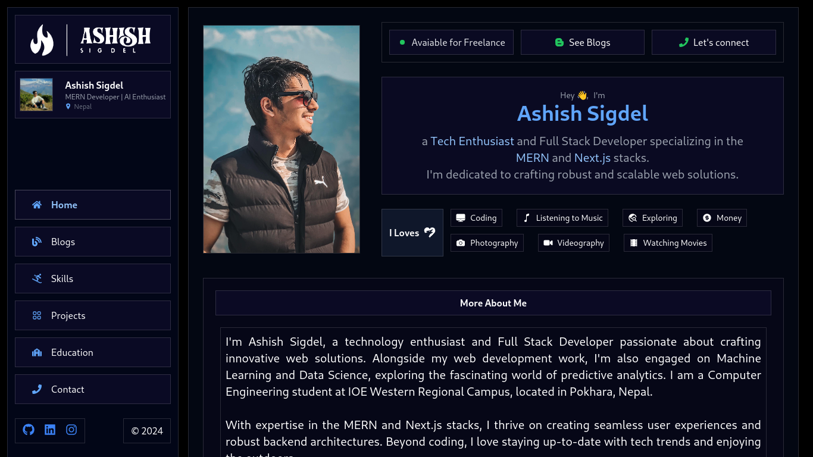
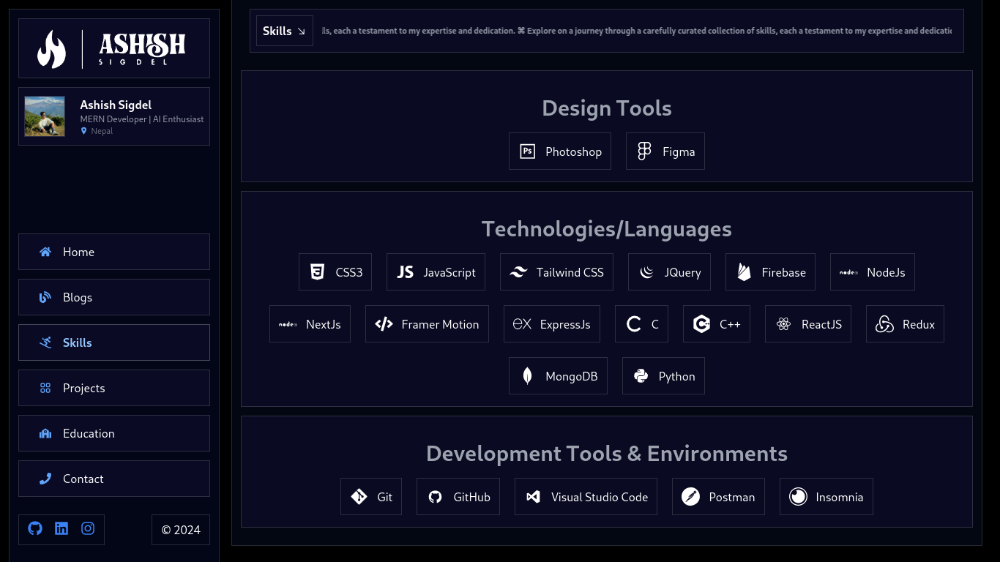

# Portfolio Website

This is a portfolio website built using the MERN stack (MongoDB, Express.js, React.js, Node.js). The project dynamically fetches project details from the backend.

## Demo






## Features

- Dynamic project loading from backend
- User authentication with JWT
- Secure password storage with bcrypt
- RESTful API built with Express
- State management with Redux Toolkit
- Firebase integration
- Responsive design using Tailwind CSS
- Email notifications using EmailJS

## Technologies Used

### Backend

- **bcryptjs**: ^2.4.3
- **cookie-parser**: ^1.4.6
- **dotenv**: ^16.4.5
- **express**: ^4.19.2
- **jsonwebtoken**: ^9.0.2
- **mongoose**: ^8.3.1
- **nodemon**: ^3.1.0
- **slugify**: ^1.6.6

### Frontend

- **React**: ^18.2.0
- **React-DOM**: ^18.2.0
- **@reduxjs/toolkit**: ^2.2.3
- **react-redux**: ^9.1.0
- **react-router-dom**: ^6.22.3
- **redux-persist**: ^6.0.0
- **firebase**: ^10.11.0
- **flowbite-react**: ^0.8.0
- **react-fast-marquee**: ^1.6.4
- **react-icons**: ^5.0.1
- **react-multi-carousel**: ^2.8.5

### Development Tools

- **Vite**: ^5.2.0
- **ESLint**: ^8.57.0
- **Tailwind CSS**: ^3.4.3
- **Autoprefixer**: ^10.4.19
- **PostCSS**: ^8.4.38

## Getting Started

### Prerequisites

Make sure you have the following installed:

- Node.js
- npm or yarn
- MongoDB

### Installation

1. **Clone the repository:**

   ```bash
   git clone https://github.com/ashishsigdel/Portfolio-ashish.git
   cd portfolio-website
   ```

2. **Backend setup:**

   ```bash
   cd backend
   npm install
   ```

3. **Frontend setup:**

   ```bash
   cd ../frontend
   npm install
   ```

### Configuration

1. **Backend:**

   Create a `.env` file in the `backend` directory with the following environment variables:

   ```env
   PORT=5000
   MONGO_URI=your_mongodb_connection_string
   JWT_SECRET=your_jwt_secret
   ```

2. **Frontend:**

   Create a `.env` file in the `frontend` directory with the following environment variables:

   ```env
   VITE_FIREBASE_API_KEY=your_firebase_api_key
   VITE_FIREBASE_AUTH_DOMAIN=your_firebase_auth_domain
   VITE_FIREBASE_PROJECT_ID=your_firebase_project_id
   VITE_FIREBASE_STORAGE_BUCKET=your_firebase_storage_bucket
   VITE_FIREBASE_MESSAGING_SENDER_ID=your_firebase_messaging_sender_id
   VITE_FIREBASE_APP_ID=your_firebase_app_id
   ```

### Running the Application

1. **Start the backend server:**

   ```bash
   cd backend
   npm run dev
   ```

2. **Start the frontend server:**

   ```bash
   cd frontend
   npm run dev
   ```

The backend server will run on `http://localhost:5000` and the frontend server will run on `http://localhost:3000`.

## Contributing

Contributions are welcome! Please fork the repository and use a feature branch. Pull requests are warmly welcome.

1. Fork the repository
2. Create a new branch: `git checkout -b my-feature-branch`
3. Make your changes and commit them: `git commit -m 'Add some feature'`
4. Push to the branch: `git push origin my-feature-branch`
5. Submit a pull request

## License

This project is licensed under the MIT License. See the [LICENSE](LICENSE) file for details.

## Contact

If you have any questions, feel free to reach out at [a.asis.sigdel01@gmail.com](mailto:a.asis.sigdel01@gmail.com).
